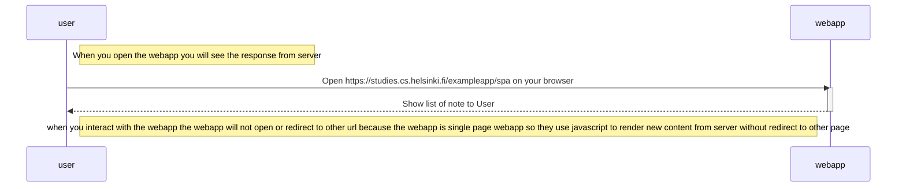

```mermaid
    sequenceDiagram
        participant user
        participant webapp

        Note right of user: When you open the webapp you will see the response from server
        user->>webapp: Open https://studies.cs.helsinki.fi/exampleapp/spa on your browser
        activate webapp
        webapp-->>user: Show list of note to User
        deactivate webapp
        Note right of user: when you interact with the webapp the webapp  will not open or redirect to other url because the webapp is single page webapp so they use javascript to render new content from server without redirect to other page 
```