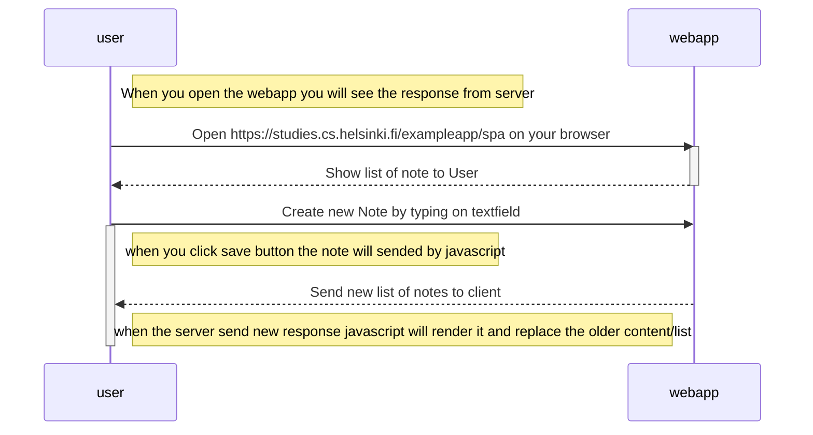

```mermaid
    sequenceDiagram
    participant user
    participant webapp

    Note right of user: When you open the webapp you will see the response from server
    user->>webapp: Open https://studies.cs.helsinki.fi/exampleapp/spa on your browser
    activate webapp
    webapp-->>user: Show list of note to User
    deactivate webapp

    user->>webapp: Create new Note by typing on textfield
    activate user
    Note right of user: when you click save button the note will sended by javascript
    webapp-->>user: Send new list of notes to client 
    Note right of user: when the server send new response javascript will render it and replace the older content/list 
    deactivate user

```